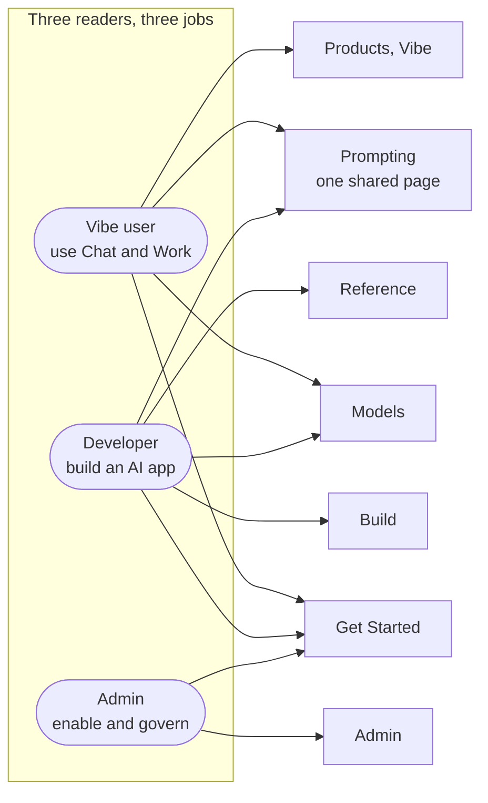

# The Audit

Three things on one page: how I reviewed the docs, what the current docs already get right (and the restructure must preserve), and the three structural problems the evidence shows.

:::note The audit in one box
I walked the live docs as a new developer with one job, build an AI app, and watched where the path broke. Every breakage was about *where things live*, not how they are written. They reduce to three findings: `Developers` is an audience-named catch-all, look-up content has no single home, and the top nav is named by product and audience rather than task. One fix underlies all three: give every page a single canonical home, organised by what the reader is trying to do.
:::

## How I audited {#how-i-audited}

I did not audit the site page by page. I walked it as a new developer would (checked 4 July 2026), carrying one real job, *build an AI application*, and watched where the path broke, then asked why. The method is that walk plus one discipline: for every placement problem I hit, I wrote the one-line rule a writer could apply to fix it ("quickstarts are orientation," "pure definitions belong in Reference"), so each finding is defensible in a sentence and doubles as a reusable content-model rule.

**The walk, and where it broke.** [Getting Started](https://docs.mistral.ai/getting-started/platform-overview) went well: I oriented and found my use case. Then three things stopped me, all structural, none of them a content problem:

1. **Getting a key meant decoding "Studio."** The API needs a key, and the key is created in Studio, but Studio is presented as a standalone product with its own onboarding (in fact *two*: "getting started with the API" and "getting started with the console"), so I had to work out that the thing I needed was just the console.
2. **"Building" had no home of its own.** Hunting the guides for conversations, agents, and RAG, I found them nested under **Studio** (the `studio-api` section is where the entire API surface lives), *and* under a separate **Developers** section, *and* as quickstarts back in Getting Started. The build content exists and is good. It just has no single front door.
3. **The overview is a product picker.** [The platform overview](https://docs.mistral.ai/getting-started/platform-overview) opens "Mistral AI has three products. Pick the one that matches what you want to do." That orients by product where the reader needs orienting by the job (build an AI application) that brought them.

That walk is the evidence base for the three findings below. I defined the architecture and the rules. Where an AI assistant helped apply and draft, the [Overview](/overview#where-ai-assisted) states the split.

The concrete change set is small: two look-up pages to move and four redundant pages to redirect. The larger change is structural: the `Developers` section dissolves and its pages re-home under the sections that own their tasks.

The rules reduce to seven principles, applied consistently:

1. **Organise around user intent, not product surface or audience.**
2. **Personas are entry points, not structure.**
3. **Keep the top nav tight and mutually exclusive** (coherence, not a fixed count).
4. **Reference is the exact source of truth, and nothing more.**
5. **Evaluate and Ship is part of Build.**
6. **Shared jobs are progressive, not duplicated** (one page, opening at its least technical reader).
7. **Section is what; surface is where** (managed vs self-hosted is an orthogonal axis, not a section).

:::note Honest limitation
This is a *structural* review of placement, rather than prose quality, code correctness, or freshness page-by-page. That scoping is deliberate, since placement is the highest-leverage problem, but it means the 4/10 findability score is a considered judgement, not a measurement.
:::

## Three journeys, one architecture {#three-journeys}

The walk above is the developer's, because that is the journey I could test end to end. But a developer is one of three primary readers, and the real test of the architecture is that it serves all three from one structure: no second site, no duplicated content.

**The Vibe user (non-technical).** This reader never touches an API, a key, or an SDK. The whole developer walk above is invisible to them. Their journey is a different shape:

1. **Orient**: "what is Vibe, and do I want Chat or Work?" (Code is Vibe's developer mode and belongs to the developer journey.)
2. **Start**: log in and open a conversation. No install, no key.
3. **Do the work**: upload a document, connect a tool (Work), set memories, run a project.
4. **Two jobs they share with the developer**: *pick a model* ("which one for me?") and *write a prompt*, wanting the plain-language answer rather than the spec sheet or the API pattern.
5. **Trust**: "is my data safe, and what can't it do?"

Today this breaks at step 4: the pages that own model-choice and prompting speak API and Studio, so a non-technical reader hits developer vocabulary on the two jobs they share. In the target IA they live in Get Started and **Products** (Vibe), kept UI-first (screens not endpoints, no API words), and the two shared jobs become one page each, opening in plain language with the API depth disclosed below ([R1](/exercise-1/recommendations#r1)). That is progressive disclosure doing the work of a separate beginner site. Which surface owns this reader at all, Products or the separate help centre, is a live [open question](/exercise-1/open-questions).

**The developer.** The full walk is above: orient in Get Started, choose in Models, build in **Build**, look things up in Reference. Studio stops being a product they must decode and becomes what it is: the console where keys and the Playground live, documented in Products.

**The admin / IT owner.** Their job is to *enable and govern* Mistral for a team: SSO and roles, billing, security, data governance, and turning on self-hosted deployment. They live in **Admin**, and the managed/self-hosted **surface axis** ([R1](/exercise-1/recommendations#r1)) threads through the pages where they stand up a private deployment. Admin survives the restructure precisely because it passes the one-bounded-job test: an admin who *calls* the API is a developer for that task and goes to Build, not Admin.

The unifying rule is the one behind [R1](/exercise-1/recommendations#r1): **personas are entry points, not sections.** The landing page surfaces each reader's starting point. From there each uses a *subset* of the same task-based sections. Split by task, not audience: a Vibe-only task (driving Chat's UI) lives only in Products, while a shared task (prompting) is one progressive page all its readers enter instead of three copies.

## What's already strong (don't touch) {#whats-already-strong}

An audit that only lists problems invites a rebuild where a refactor would do. What the current docs get right sets the boundary of the proposal:

| Strength | Disposition |
|---|---|
| Fast, task-shaped quickstarts (honest "5 min" time costs) | **Preserve**; give them task-named canonical URLs ([R1](/exercise-1/recommendations#r1)) |
| Consistent model cards (context window, pricing, capabilities) | **Preserve**; they anchor the Models selection surface |
| 125 runnable Cookbooks | **Preserve** as a utility link, *except* sole-source-core recipes (below) |
| Persona awareness (Vibe user / developer / admin) | **Preserve the intent**; re-express as landing-page entry points |

On Cookbooks: most are supplementary and stay a utility surface. The exception is a cookbook that is the *only* home for a *core* task, which means a Build guide is missing. Those get promoted (teaching to a Build how-to, notebook kept as its runnable companion). The one clean live example is **tokenization and chat templates** (five cookbooks, no Build, Models, or Reference page). Two apparent candidates, fine-tuning and the Classifier Factory, looked sole-sourced but proved *deprecated* on the live site. The freshness note below records that check. Promotion is only as safe as the validation behind it.

## The findings {#the-findings}

Three structural problems, in order of how much they cost the reader.

### Finding 1: `Developers` is a catch-all

`Developers` is a top-level section defined by *audience* rather than *task*, and the label fails twice. First, not everyone who builds with the API identifies as a "developer". Data scientists, technical PMs, and solutions engineers build too, but an identity label asks them to self-sort under a name they may not claim. Second, the section doesn't even hold the building work: conversations, agents, and RAG live under **Products › Studio**, while `Developers` mostly holds reference (changelogs, SDKs, the error glossary, migration guides) that isn't exclusive to developers anyway, since an admin tracking new model releases reads the changelog too. The test a section must pass is whether it has one bounded job with a clear admission rule: `Admin` has one and survives the restructure (organisation setup and governance, SSO, billing, roles), because an admin who calls the API goes to Build, not Admin. `Developers` names an identity, not a job, so nothing rules a page in or out and the section cannot enforce a content model.

**Why it matters:** every audience-named section competes with the task-named sections for the same content. The fix is to give every page one canonical home (orientation in Get Started, guidance in Build, look-ups in Reference) and to express the developer persona as a landing-page entry point instead. See [R1](/exercise-1/recommendations#r1).

### Finding 2: Look-up content has no single home

Pure look-up content is scattered across the site, and where it is gathered, it is blended with teaching content. The glossary sits under Getting Started. The crawler spec sits at the site root. The changelog, error glossary, and known limitations sit in a Resources bucket alongside 125 teaching cookbooks and a quickstart.

| Live today | What it is |
|---|---|
| `/getting-started/glossary` | Pure definitions, filed in the orientation section |
| `/robots` | Crawler identification spec, at the site root |
| `/resources/error-glossary`, `/resources/known-limitations` | Look-up content, blended with 125 teaching cookbooks |

**Why it matters:** a reader who needs to look something up mid-task cannot guess which of three surfaces holds it, and Reference cannot be trusted as the source of truth while look-ups live elsewhere. This is about look-ups that belong to *no single job*. Model specs are the exception that proves the rule: at an LLM company, choosing a model is itself a primary job, so its specs live with that job in Models. Reference gets only the look-ups no section owns: the glossary, error codes, limits, the crawler spec. See [R2](/exercise-1/recommendations#r2).

### Finding 3: The top navigation is named by product and audience, not task

`Products`, `Developers`, and `Admin` read as surfaces and audiences rather than goals, so a reader must first know which Mistral surface owns their task before they can navigate to it. That is orientation cost the docs impose before any content is read. The fix is not to purge every label that sounds like an audience, but to keep only the ones that map to a bounded job: `Admin` (organisation setup) and `Products` (use the products) survive, reframed by the job they answer, while `Developers` maps to no single job and is the one that dissolves.

The cost is concrete in the developer journey I walked ([How I audited](#how-i-audited)). To get an API key you must enter **Studio**, which presents itself as a standalone product with its own getting-started rather than the console tool it is. The guidance for *building* is then split three ways: the API surface itself (conversations, agents, RAG) is filed under **Studio**, more developer guidance sits in the **Developers** section, and the quickstarts sit under **Getting Started**. Three homes, and the reader assembles the path.

The same product-first framing repeats at every level. The [platform overview](https://docs.mistral.ai/getting-started/platform-overview) opens on a product picker ("three products, pick one") instead of the build journey the developer came for. One level up, the docs home (`docs.mistral.ai`) leads with three product cards (Vibe, Studio, Admin), which the [Appendix landing-page design](/appendix#2-landing-page-design) replaces with persona entry points. One level down, quickstarts group by persona (developer, admin, vibe-work) even though each quickstart is already a task, and the persona and product segments in those URLs churn on every rename, as the retired `le-chat` paths show.

**Why it matters:** navigation should answer "what do I want to do?" (orient, build, evaluate, ship), not "which product is this?" or "who are you?". This is the root cause beneath Findings 1 and 2. See [R1](/exercise-1/recommendations#r1).

### A wayfinding gap: which product am I in? {#wayfinding}

Finding 3 is about reaching the right place. This is about knowing where you are once you arrive. `Products` holds two products for two different readers, **Studio** (the developer console) and **Vibe** (the end-user app), who would rarely be in both in one session. Yet the deep reader has little to hold onto: there are no breadcrumbs, and the section label does not stay pinned, so someone dropped several levels in by search cannot easily tell whether they are reading about Studio or about Vibe (checked live, 7 July 2026).

**Why it matters:** the moment a section deliberately holds more than one product for more than one audience, wayfinding stops being cosmetic. The fix is not to split them, since both are "use the products" and both belong in `Products`, but to make the context persistent: breadcrumbs, and a "you are here" product marker that survives scrolling and deep landings. That is the same mechanism [R1](/exercise-1/recommendations#r1) specifies for the managed/self-hosted surface, extended to the product you are in.

### A freshness issue validation surfaced {#a-freshness-issue-validation-surfaced}

This audit scopes to structure, not freshness ([How I audited](#how-i-audited)). But validating the cookbook-promotion candidates above against the live site turned up one freshness problem worth recording. Fine-tuning and the Classifier Factory now live in a *Deprecated features* area (`/resources/deprecated/finetuning` and `/resources/deprecated/finetuning/classifier_factory`; the old `/capabilities/finetuning` URL 301s there) and carry a **"Deprecated. This feature is deprecated and is no longer actively supported"** banner, with the fine-tuning overview pointing readers to prompt engineering as the faster starting point. Yet the matching cookbooks (`mistral-fine_tune-mistral_finetune_api` and the three `classifier_factory` recipes) are still live and carry **no** deprecation notice (re-verified 6 July 2026), so a reader arriving from search invests in a retired workflow: a dedicated deprecation surface exists, and it still has not propagated to the cookbooks.

**Why it matters:** a deprecation has to propagate to *every* surface that teaches the capability, cookbooks included, or the docs actively mislead. This is a lifecycle-governance gap rather than a placement one, and the rule it implies is simple: a deprecation is not done until its examples are banner-marked or retired.

:::tip Next step
Turn the evidence into a plan: the [Recommendations](/exercise-1/recommendations).
:::
