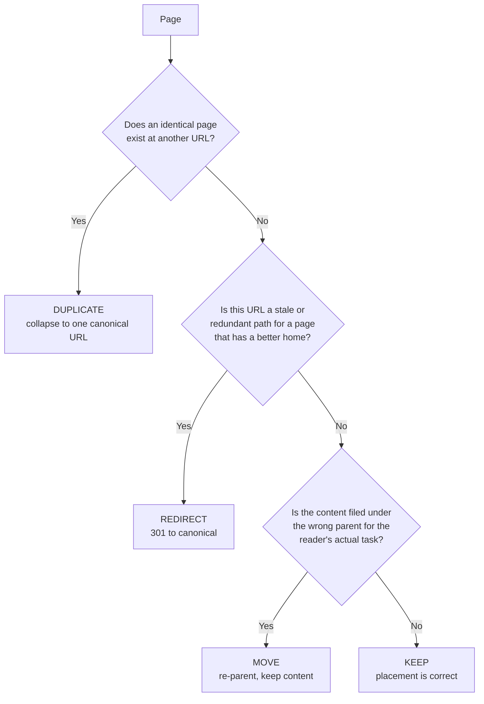

# Review Methodology

A recommendation is only as trustworthy as the method behind it. This page describes how the audit was produced so that any finding can be traced back to a repeatable process rather than an opinion.

## Scope

The audit covers **every page reachable from the primary navigation of `docs.mistral.ai`**, 420 pages at the time of review. Cookbooks and the generated API reference were included in the inventory but treated as utility surfaces (see [Strengths](/exercise-1/strengths)), not as sections to be restructured.

## The audit as a data set

Rather than review pages ad hoc, I built a single spreadsheet with one row per URL. Each row records where the page *is* and where it *should be*:

| Column | Purpose |
|--------|---------|
| `url` | The current live URL, the unit of analysis |
| `page_title` | The page's own title, for identification |
| `proposed_l1 … proposed_l4` | The proposed placement, up to four levels deep |
| `url_flag` | The action, if any: `DUPLICATE`, `REDIRECT`, `MOVE`, or `KEEP` |
| `writer_placement_rule` | A one-line rationale for the placement, the heuristic a writer would apply |

The `writer_placement_rule` column is the important one. It forces every placement decision to be defensible in a single sentence, and it doubles as a **content-model rule** the docs team can reuse: "prompting guidance is a build concern," "model cards carry specs only," "pure definitions belong in Reference."

The full data set is explorable on the [Audit Findings](/exercise-1/audit-findings) page and downloadable from the [Appendix](/exercise-1/appendix).

## Classification scheme

Each page received exactly one action flag:

Pages that were already correctly placed carry no explicit flag, they are implicit `KEEP`s. This keeps the flagged set small and actionable: **46 of 420 pages** need any change at all.

## Placement principles

Placement decisions followed a small set of principles, applied consistently:

1. **Organise around user intent, not team structure.** Navigation should mirror how users work, orient, build, evaluate, ship, not Mistral's internal org chart.
2. **Personas are entry points, not structure.** "Le Chat user" and "developer" are ways *into* the docs (a landing page), not top-level sections that fragment shared content.
3. **Top-nav cognitive load is a hard constraint.** Six top-level sections is the ceiling; beyond that the reader scans instead of reads.
4. **Reference is the exact source of truth, and nothing more.** Definitions, specs, and parameters go here; anything that teaches a task does not.
5. **Evaluate and Ship is part of Build.** Shipping is the last phase of building, not a separate destination.

These are the same principles that produced the [Information Architecture redesign](/appendix) reused throughout this submission.

## Validation

Every load-bearing claim in this proposal was re-checked against the live `docs.mistral.ai` at the time of writing, the existence of the `Developers` section, the duplication of quickstart URLs, and the filing of prompt-engineering and sampling guides under `Models`. Where the live site had changed since the original audit, the finding was updated rather than asserted from memory.

:::note Honest limitation
This is a **structural** audit. It does not assess prose quality, code-sample correctness, or freshness page-by-page, those deserve their own passes. Scoping the audit to placement is deliberate: it is the highest-leverage problem, and mixing it with copy-editing would have produced a less actionable result.
:::

:::tip Next step
See [what is already working](/exercise-1/strengths), the parts of the current docs the restructure must preserve.
:::
