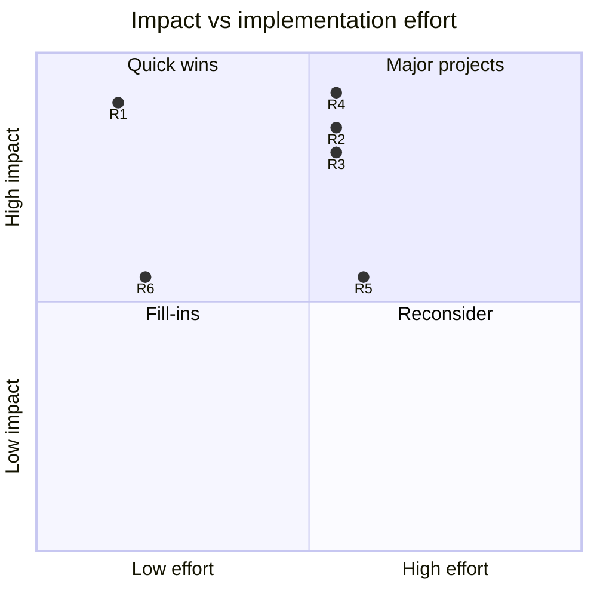
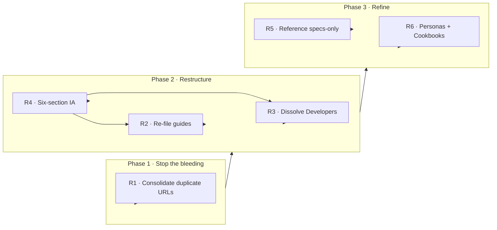

# Prioritisation

Six recommendations are only useful if they arrive in the right order. This page sequences them by **impact**, **effort**, and **dependency**, and makes the sequencing rationale explicit rather than asserting a rank.

## The six at a glance

| ID | Recommendation | Impact | Effort | Priority |
|----|----------------|--------|--------|----------|
| [R1](/exercise-1/recommendations#r1) | Consolidate duplicate quickstart URLs | High | Low | **P1** |
| [R4](/exercise-1/recommendations#r4) | Reorganise top nav into six intent-based sections | High | Medium | **P1** |
| [R2](/exercise-1/recommendations#r2) | Re-file guides by task, not noun | High | Medium | **P1** |
| [R3](/exercise-1/recommendations#r3) | Dissolve the Developers junk drawer | High | Medium | **P1** |
| [R5](/exercise-1/recommendations#r5) | Make Reference specs-only | Medium | Medium | **P2** |
| [R6](/exercise-1/recommendations#r6) | Personas as entry points; Cookbooks as utility | Medium | Low | **P2** |

## Impact vs. effort

R1 is the only true quick win (high impact, low effort), and it ships first regardless of anything else. R4 is the highest-impact change overall but is the umbrella the others depend on, so it is sequenced as the framing decision rather than a standalone task.

## Dependency-aware sequencing

The recommendations are not independent. R2 and R3 move pages *into* the structure that R4 defines, so R4 must be **decided** first even though R1 **ships** first.

## Phased plan

**Phase 1, Stop the bleeding (days).** Ship **R1**. It is pure URL work with redirects, needs no structural agreement, and immediately removes 20 flagged pages and the search-cannibalisation problem. Doing it first also builds confidence for the larger change.

**Phase 2, Restructure (weeks).** Decide **R4** (the six-section architecture), then execute **R2** and **R3** against it. These are page moves and redirects, not rewrites, but they touch navigation and should ship together so readers experience one coherent change rather than several confusing partial ones.

**Phase 3, Refine (ongoing).** Apply **R5** and **R6** as the content model settles. These are lower-urgency guardrails that keep the new structure from drifting back, the "look up vs. learn" test for Reference, and the landing-page routing for personas.

:::note Why not do it all at once
Sequencing R1 ahead of the restructure delivers a visible win in days and de-risks the larger change. Sequencing R5/R6 last is deliberate: they are guardrails, and guardrails are cheap to add once the road exists but wasteful to build before it.
:::

:::tip Next step
See the change made concrete on one page: the [Example Rewrite](/exercise-1/example-rewrite).
:::
