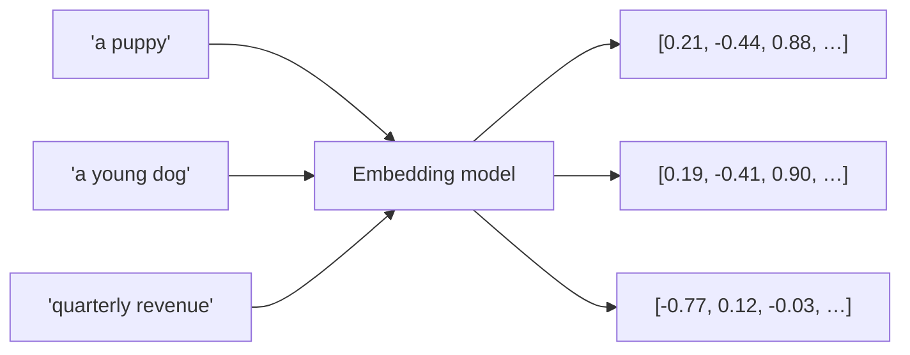
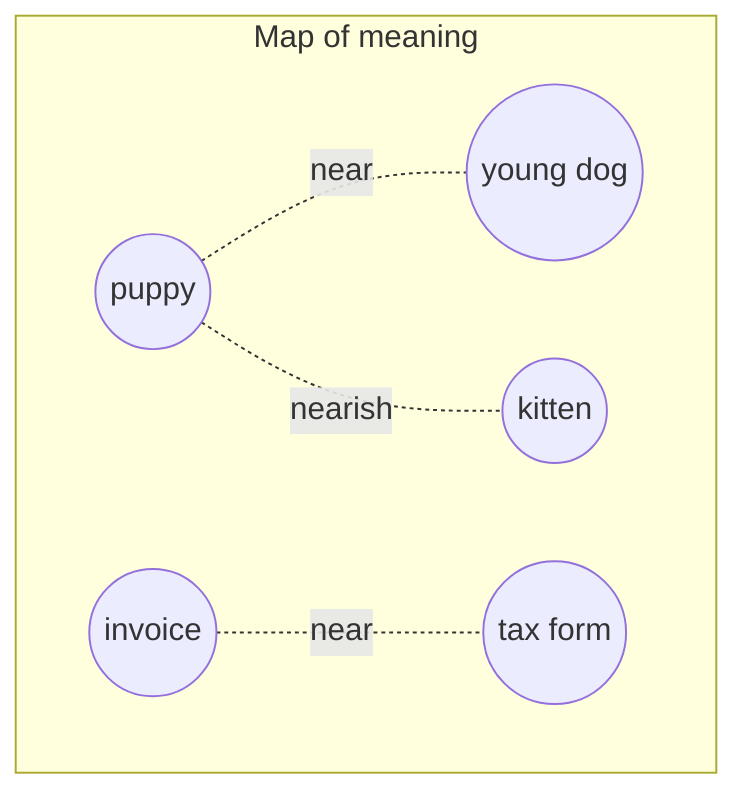

# What are embeddings?

<p className="doc-meta">The job: understand what an embedding is. Reader: a developer who can code but is new to AI. No maths required.</p>

Computers are good with numbers and bad with meaning. The word "dog" is just a string of characters to a computer. It has no idea that "dog" is closer to "puppy" than to "spreadsheet". Embeddings are how we fix that. They turn a piece of text into a list of numbers that captures what it *means*, so that a computer can compare meanings the way it compares numbers.

## The one-sentence version

> An embedding gives every piece of text a position on a giant map of meaning, where things that mean similar things end up near each other.

That map has far more than two directions, but the intuition is exactly a map: nearby = similar in meaning, far apart = unrelated.

## A picture



The model reads text and outputs a list of numbers, called a **vector**. "A puppy" and "a young dog" get numbers that put them close together, because they mean almost the same thing. "Quarterly revenue" lands far away.

## The map analogy, made concrete

Imagine placing every sentence as a pin on a map:



- "puppy" and "young dog" sit almost on top of each other.
- "kitten" is nearby, because it is also a baby animal, but it is not a dog.
- "invoice" and "tax form" are off in a completely different neighbourhood.

The embedding model decides all these positions for you, from the text alone.

## Why this is useful: search by meaning

Ordinary search matches words. If you search a support site for "my card was declined" but the article says "payment failed", keyword search may miss it: the two phrases share no words.

Embeddings match **meaning**. Both phrases land in the same neighbourhood of the map, so a search that compares embeddings finds the article even with zero shared words. This is the engine behind modern AI search and behind **RAG** (retrieval-augmented generation), where an AI app looks up relevant text before answering.


## Try it with Mistral

Mistral's text embedding model is [`mistral-embed`](https://docs.mistral.ai/capabilities/embeddings) (it also has `codestral-embed` for code). You give it text; it gives you the numbers.

```python
import os
from mistralai import Mistral

client = Mistral(api_key=os.environ["MISTRAL_API_KEY"])

response = client.embeddings.create(
    model="mistral-embed",
    inputs=["a puppy", "a young dog", "quarterly revenue"],
)

# Each input becomes a list of 1024 numbers.
first = response.data[0].embedding
print(len(first), [round(x, 4) for x in first[:3]])
```

```text
1024 [-0.0432, -0.0194, 0.0463]
```

Every piece of text becomes a list of 1024 numbers: its coordinates on the map. The numbers above are the real output for "a puppy", captured from the live run in [Exercise 3](/exercise-3-api-validation). And when you measure how close the three points are (Exercise 3 does this on these exact vectors), the geometry matches the meaning: "a puppy" and "a young dog" score 0.89 similarity on a 0-to-1 scale, while "a puppy" and "quarterly revenue" manage only 0.58.

:::tip The mental model to keep
Text goes into the embedding model and comes out as a point in space. Similar meanings land at nearby points. Everything else (semantic search, RAG, clustering, recommendations) is just measuring distances between those points.
:::

## Where to go next

You now have the intuition. The engineering questions (how similarity is measured, how search stays fast over millions of vectors, and what trade-offs you are signing up for) are covered in [Design a retrieval system with embeddings](/exercise-2/version-b).

:::note Next step
Read [Design a retrieval system with embeddings](/exercise-2/version-b), or see embeddings used in a live request in [Exercise 3](/exercise-3-api-validation).
:::
