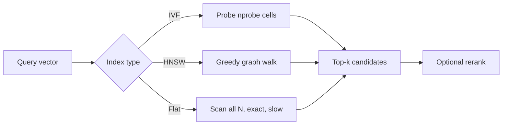

# Vector Embeddings for Engineers

<p className="doc-meta">Audience: engineers comfortable with vectors and ML basics. Straight to the design decisions.</p>

An embedding is a learned map from an input (text, code) to a dense vector in ℝⁿ such that semantic similarity corresponds to geometric proximity. This page assumes you accept that framing and focuses on the four decisions that actually determine whether a retrieval system works: **dimensionality, similarity metric, index, and retrieval quality**, and the trade-offs each imposes.

## Embedding dimensions

`mistral-embed` returns a fixed **1024-dimensional** vector for any input, independent of input length. Dimensionality is a capacity/cost trade-off:

- **Higher dimensions** can encode more distinctions before collapsing unrelated concepts, but cost linearly more storage and more compute per distance evaluation.
- Storage for a corpus is `N × d × 4 bytes` at float32. One million 1024-dim vectors ≈ **4 GB** in RAM before any index overhead, often the binding constraint, and the reason quantization (int8, product quantization) matters at scale.

A useful discipline: the embedding dimension is part of your system's cost model, not a detail. Doubling `d` roughly doubles memory and exact-search latency for the same recall.

## Semantic similarity and cosine similarity

Similarity is a distance in embedding space. The default metric for text embeddings is **cosine similarity**, the cosine of the angle between two vectors:

```text
cos(A, B) = (A · B) / (‖A‖ · ‖B‖)     ∈ [-1, 1]
```

Cosine is preferred over raw Euclidean distance because it is **invariant to vector magnitude**, it compares orientation (what the text is about) rather than length (which can correlate with incidental factors). In practice:

- If you **L2-normalise** every vector to unit length, then cosine similarity equals the dot product, and Euclidean distance becomes a monotonic function of cosine. This lets you use fast dot-product kernels and still get cosine ordering.
- Normalise once at write time; then similarity is a single dot product at query time.

```python
import numpy as np

def cosine(a, b):
    a, b = np.asarray(a), np.asarray(b)
    return float(a @ b / (np.linalg.norm(a) * np.linalg.norm(b)))

# If vectors are pre-normalised, cosine(a, b) == a @ b.
```

:::caution Don't mix metrics
Whatever metric you index with must match the metric you normalise for. Building an inner-product index over un-normalised vectors silently ranks by magnitude as much as by meaning, a common and hard-to-spot retrieval bug.
:::

## Approximate nearest-neighbour (ANN) search

Retrieval is a k-nearest-neighbour query. **Exact kNN is O(N·d)** per query, a full scan, which is fine for thousands of vectors and unacceptable for tens of millions. ANN indexes trade a small amount of recall for orders-of-magnitude lower latency:

| Index family | Idea | Trade-off |
|---|---|---|
| **HNSW** | Navigable small-world graph; greedy descent | Excellent recall/latency; high memory; slow to build |
| **IVF** | Partition space into cells; probe a few | Tunable via `nprobe`; recall drops if too few cells probed |
| **IVF-PQ** | IVF + product quantization of residuals | Big memory savings; quantization error lowers recall |
| **Flat (exact)** | Brute force | 100% recall; only viable at small N |



The governing knob is the **recall/latency curve**: `efSearch` (HNSW) or `nprobe` (IVF) buys recall at the cost of latency. Tune it against a labelled query set, not by feel, "looks fine" is not a recall number.

## Retrieval quality

An accurate embedding model does not guarantee good retrieval. Quality lives in the pipeline around it:

- **Chunking.** Embeddings represent whole inputs; a 10-page document embedded as one vector averages away the passage you actually need. Chunk to retrieval-sized units (paragraphs/sections) with slight overlap, and embed each chunk.
- **Query/document asymmetry.** A short query and a long passage sit at different scales. Symmetric single-encoder models like `mistral-embed` handle this reasonably, but it is why **rerankers** (cross-encoders scoring query-chunk pairs) lift precision@k noticeably.
- **Hybrid search.** Dense retrieval misses exact-token matches (error codes, identifiers, rare names). Combining dense similarity with a lexical signal (BM25) recovers those cases; dense + lexical hybrids usually beat either alone.
- **Measure it.** Track `recall@k` and `MRR/nDCG` on a held-out query set. Without a metric you cannot tell whether a change to chunking, `k`, or the index helped or hurt.

## Trade-offs, summarised

| Decision | Lever | If you push it |
|---|---|---|
| Dimensionality | fixed at 1024 for `mistral-embed` | drives memory and exact-search cost linearly |
| Metric | cosine (normalise to dot product) | mismatched metric/normalisation corrupts ranking |
| Index | Flat to IVF to HNSW to PQ | recall vs latency vs memory; pick per corpus size |
| Chunk size | small vs large | small = precise but more vectors; large = cheaper but blurrier |
| Retrieval `k` | how many to fetch | high `k` raises recall, adds reranking/LLM cost |
| Model | `mistral-embed` (text) vs code embeddings | match the model to the modality; don't embed code with a text model |

## Using `mistral-embed`

```python
import os, numpy as np
from mistralai import Mistral

client = Mistral(api_key=os.environ["MISTRAL_API_KEY"])

docs = ["Payments can fail when a card is declined.",
        "Configure SSO with SAML in the admin console."]
q = "why was my card declined?"

emb = client.embeddings.create(model="mistral-embed", inputs=docs + [q])
vecs = [np.asarray(d.embedding) for d in emb.data]
*doc_vecs, q_vec = vecs

# Normalise once, then rank by dot product (== cosine).
def unit(v): return v / np.linalg.norm(v)
scores = [float(unit(q_vec) @ unit(d)) for d in doc_vecs]
print(sorted(zip(scores, docs), reverse=True)[0])   # nearest doc
```

At production scale you would push `doc_vecs` into a vector index (FAISS, hnswlib, or a managed vector DB) rather than scanning in NumPy, but the semantics are exactly the loop above.

:::note Next step
See a real embeddings request and its actual response in [Exercise 3, Validating the Mistral API](/exercise-3-api-validation).
:::
