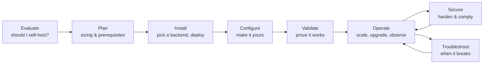
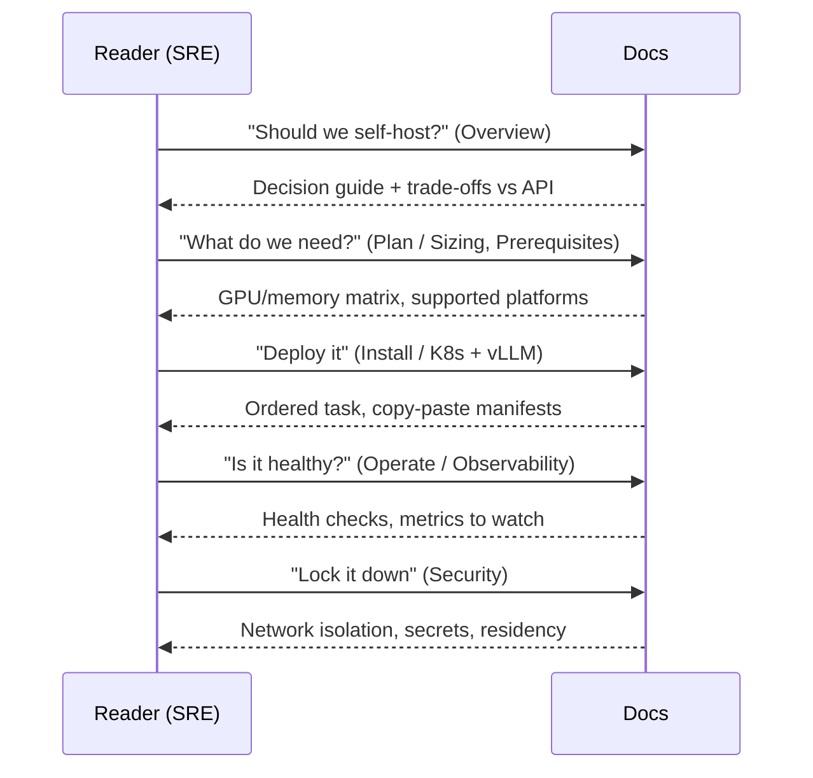
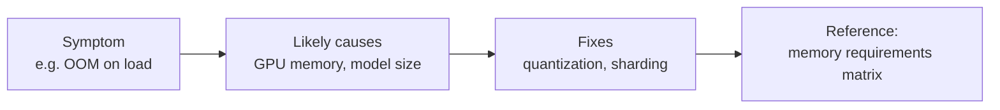

# Information Architecture: On-Prem Deployment

Exercise 4 · Documentation architecture · This is the IA design, not the documentation itself

The brief is explicit: **design the information architecture for Mistral's on-prem deployment documentation, do not write the documentation itself.** So this page is a design artefact. It defines the mental models, the navigation, the content-type separation, and the journeys, and it justifies each decision against how Kubernetes and Terraform, two projects that document genuinely hard self-managed software well, solve the same problems.

## Why on-prem deployment is hard to document

Self-hosting docs fail in predictable ways, and the failure is usually structural, not editorial:

1. **They mix audiences.** An evaluator deciding *whether* to self-host, an SRE *operating* a cluster, and a security reviewer *auditing* it need different things from the same corpus.
2. **They mix content types.** "Concepts", "how do I do X", and "what is every config flag" get interleaved on one page, so no reader can scan.
3. **They organise by tool, not by journey.** A page per backend (vLLM, TGI, TensorRT-LLM) with no spine leaves the reader to assemble the path (prerequisites, install, configure, validate, operate) themselves.

The design below is built to prevent all three.

## Mental model: the reader is on a journey, not at a page

The core design decision is to treat on-prem deployment as a **lifecycle** the reader moves through, and to make the top-level structure mirror that lifecycle. Every page belongs to a phase, and the reader always knows which phase they are in.

This is the same instinct behind the Kubernetes **"Setup"** journey (learning environment to production cluster) and Terraform's **"Get Started to Use Cases to Operations"** progression: the docs carry the reader through phases rather than dumping a flat reference.

## Content-type separation (the load-bearing decision)

Kubernetes and Terraform both separate content by *type*, following the Diátaxis model, Tutorials, How-to Guides, Concepts, Reference are distinct and never blended. Kubernetes labels its sections exactly this way (**Concepts**, **Tasks**, **Tutorials**, **Reference**); Terraform separates hand-written **guides/tutorials** from **language and provider reference** that is largely generated and exhaustive.

The on-prem IA adopts the same separation as a hard rule:

| Content type | Answers | Example page | Rule |
|---|---|---|---|
| **Concept** | "How does this work / what is it?" | *How inference serving works* | Explains; never lists every flag |
| **Task (how-to)** | "How do I do X?" | *Deploy Mistral on Kubernetes with vLLM* | Goal-oriented, ordered steps, one outcome |
| **Tutorial** | "Walk me through my first one" | *Serve your first model on a single GPU* | Learning-oriented, safe to fail |
| **Reference** | "What is the exact value of X?" | *Server configuration parameters* | Exhaustive, scannable, no narrative |

:::note Why this matters more on-prem than anywhere else
Deployment is where readers most want to **look something up mid-incident** (a flag, a port, an env var) and least want to read prose. Keeping Reference exhaustive and separate, and keeping Tasks free of reference dumps, is what makes the docs usable at 2 a.m. This is the same reason [Recommendation R5](/exercise-1/recommendations#r5) keeps the main docs' Reference specs-only.
:::

## Proposed navigation

A single **Self-managed Deployment** section, structured by lifecycle phase, with Reference broken out as its own scannable surface:

```mermaid
flowchart TB
  Root[Self-managed Deployment] --> Overview[Overview & when to self-host]
  Root --> Plan[Plan]
  Root --> Install[Install]
  Root --> Operate[Operate]
  Root --> Secure[Security & Compliance]
  Root --> Trouble[Troubleshooting]
  Root --> Ref[Reference]

  Plan --> P1[Sizing & GPU requirements]
  Plan --> P2[Prerequisites & supported platforms]
  Plan --> P3[Architecture patterns]

  Install --> I1[Quickstart: single node]
  Install --> I2[Kubernetes + vLLM]
  Install --> I3[TGI / TensorRT-LLM backends]
  Install --> I4[Air-gapped install]

  Operate --> O1[Scaling & load balancing]
  Operate --> O2[Upgrades & rollback]
  Operate --> O3[Observability & health]
  Operate --> O4[Model & weight management]

  Secure --> S1[Network & isolation]
  Secure --> S2[Secrets & key management]
  Secure --> S3[Data residency & compliance]

  Ref --> R1[Server config parameters]
  Ref --> R2[Environment variables]
  Ref --> R3[Error codes & exit states]
  Ref --> R4[Compatibility matrix]
```

Navigation principles applied:

- **Lifecycle at the top level, tools one level down.** Backends (vLLM, TGI, TensorRT-LLM) are *choices within Install*, not top-level sections, mirroring how Kubernetes puts "container runtimes" under setup tasks rather than at the top, and how Terraform nests providers under a common workflow.
- **One "Overview" front door** that answers the evaluate question and routes the three audiences, exactly the role Terraform's "Introduction" and the Kubernetes "Overview" play.
- **Reference is a sibling, not a child, of the tasks.** It is reachable from every phase because that is how it is used.

## Deployment journeys

The IA encodes named journeys so the reader can follow a spine instead of assembling one. Each journey is an ordered path across the sections above.

**Primary journeys the IA must serve first-class:**

1. **Evaluator** to Overview to Plan (trade-offs, sizing) to decision. May never install.
2. **First deploy** to Quickstart (single node) to Validate. Learning-oriented, safe.
3. **Production deploy** to Plan to Install (K8s + vLLM) to Operate to Security. The real path.
4. **Air-gapped / sovereign** to Overview to Air-gapped install to Security (data residency). The differentiated path Mistral should feature, echoing the "Deploy on your own infrastructure" entry point in the [landing-page design](/appendix).

## Operations, security, troubleshooting

These three are first-class top-level phases, not appendices. The mistake most self-hosting docs make is treating them as afterthoughts.

- **Operations** is task-based and lifecycle-shaped: scaling, upgrades/rollback, observability, model management. It borrows Terraform's "operations and workflow" framing and Kubernetes' "Administer a Cluster" task cluster, day-2 concerns get their own home, distinct from install.
- **Security & Compliance** is a *named destination*, because on-prem is often chosen *for* security and a reviewer needs to audit without reading install guides. It follows Kubernetes' pattern of a dedicated Security section rather than scattering security notes into task pages.
- **Troubleshooting** is structured as **symptom to cause to fix**, cross-linked from the tasks and operations pages that can produce each symptom, not a flat FAQ. Reference-grade error codes live in Reference; the *diagnosis narrative* lives here.

## Why this structure, summary of the borrowings

| Decision | Borrowed from | Rationale |
|---|---|---|
| Separate Concept / Task / Tutorial / Reference | Kubernetes (Diátaxis) | Each reader mode gets a surface it can scan |
| Lifecycle phases as top-level nav | Terraform (Get Started to Use Cases to Operations) | Readers deploy in phases; nav should match |
| Backends nested under Install | Both | Tool choice is a step, not a section |
| Reference exhaustive + generated where possible | Terraform provider/registry reference | Config surfaces are large and change often |
| Dedicated Security destination | Kubernetes Security section | On-prem is often chosen *for* security; auditors need a door |
| Symptom-based Troubleshooting | Kubernetes "Debug" tasks | Incidents are entered by symptom, not by cause |

:::note What I deliberately did not do
I did not write the pages. I also did not design a page-per-backend top level (the most common on-prem docs anti-pattern), it optimises for the docs author's mental model (one tool = one page) over the reader's (one goal = one journey). The lifecycle spine is the whole point.
:::

:::tip Next step
Continue to [Exercise 5, Workflows Enablement](/exercise-5-workflows-enablement).
:::
