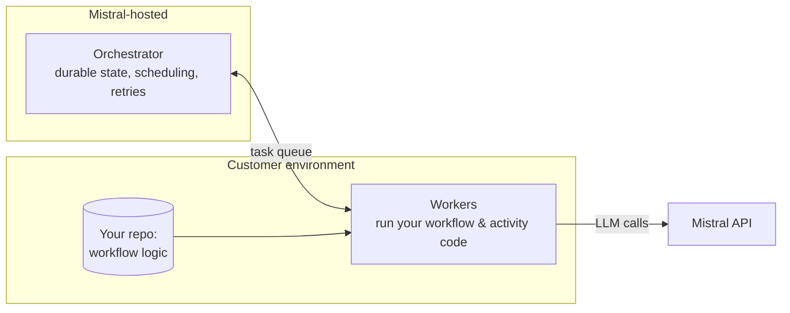

# Internal Enablement: Mistral Workflows

Exercise 5 · Internal enablement · Audience: Solutions Engineers · Read time: ~6 min

:::note Internal document
This is a **field cheat sheet for SEs**, not customer-facing docs. It is deliberately terse: what Workflows is, how to demo it, and how to handle the questions and objections that come up in the room.
:::

## What is Workflows?

**One-liner:** Workflows is durable orchestration for production AI, multi-step processes (LLM calls, tool use, external APIs, human approvals) that survive crashes, restarts, and failures without the customer building the plumbing.

**The pitch in three sentences:**
> Real AI features aren't one API call, they're pipelines with retries, waits, approvals, and steps that fail. Building that reliably means durable state, retries, scheduling, and observability, which teams usually reinvent badly. Workflows gives them that execution layer, so they write the business logic and Mistral runs it reliably.

**When it lands:** a prospect who has a working prototype but is stuck making it *production-grade*, "it works in the notebook, but it falls over when a step times out / needs a human to approve / has to run for two days."

## How it works

- **Durable execution.** Every step's state is persisted. If a worker crashes mid-run, the workflow resumes from the last completed step, no lost progress, no double-charging a customer, no manual replay.
- **Long-running.** A workflow can pause on a human signal or external event and resume when it arrives, runs span **seconds to months**.
- **Built-in observability.** Live event streaming, queryable history, and OpenTelemetry traces with no extra wiring.
- **AI primitives included.** Agent loops, token streaming to clients, and Mistral API calls without writing integration glue.

Under the hood, durability is powered by **Temporal** (the open-source fault-tolerant orchestration engine). SEs should know this: it is a credibility signal with technical buyers and pre-empts "did you build your own unproven scheduler?"

## Demo scenario

**Scenario: "Meeting notes to dev tickets" with a human approval gate.** Concrete, visual, and shows off the three differentiators (durability, human-in-the-loop, observability) in one flow.

1. Upload a meeting transcript, and an agent extracts the action items.
2. Workflow **pauses** for a human to approve/edit the proposed tickets (could be minutes or days).
3. On approval, it creates tickets via an external API (Jira/Linear).
4. Kill a worker mid-run to show it **resumes** exactly where it stopped.
5. Open the trace to show every step, retry, and the wait.

:::tip The money moment
Step 4, killing the worker and watching the workflow resume, is what makes the durability claim visceral. Don't skip it. It is the single hardest thing to fake in a competitor's demo.
:::

## Architecture

Workflows runs in **hybrid mode**: Mistral hosts the orchestrator; the customer's own code and workers run in *their* environment.

**Why this matters commercially:** the customer's **code and data-handling logic execute in their own infrastructure** (laptop for dev; Kubernetes or VMs for prod), while Mistral runs the reliability layer. That split is the answer to most security and sovereignty objections. Lead with it.

## Customer objections

| Objection | SE response |
|---|---|
| "We already use Airflow / Temporal ourselves." | Great, Workflows *is* Temporal-based, plus the AI primitives (agent loops, streaming, Mistral integration) you'd otherwise hand-build. It's the AI-native layer on top, not a rip-and-replace of your scheduler. |
| "We don't want our data going to Mistral." | Your **workers run in your environment**; your code and data handling stay there. Mistral hosts the orchestrator (state/scheduling), not your data pipeline. Walk them through the hybrid diagram. |
| "Isn't this just a for-loop with retries?" | Until a step waits three days for approval, a worker crashes, or you need an audit trail of every run. That's when the for-loop becomes a distributed-systems project. Workflows is that project, solved. |
| "Why not LangGraph / a framework?" | Frameworks help you *author* logic; they don't give you durable execution, scheduling, and observability as a managed service. Different layer, often complementary. |
| "What's the lock-in?" | Built on open-source Temporal; your workflow code is in your repo. The orchestration semantics are portable, which lowers switching risk. |

## FAQ

**Does it only work with Mistral models?** The AI primitives are Mistral-native, but workflows can call any external API as a step, so it orchestrates heterogeneous systems.

**What languages?** Confirm the current SDK list against the docs before the call, do not guess in the room.

**How is it priced?** Pricing is commercial-team territory; don't quote numbers. Position on value (reliability, reduced eng time), route specifics to AE.

**Can it schedule recurring jobs?** Yes, cron-style or one-shot scheduled runs are a first-class use case.

## Enterprise positioning

Lead with the three things enterprises can't easily build themselves:

1. **Reliability as a guarantee**, not best-effort: durable state and automatic resume.
2. **Own-infrastructure execution**: code and data logic stay in the customer's environment (a sovereignty story that ties to Mistral's on-prem positioning).
3. **Auditability**: every run, step, retry, and wait is traceable, which is a compliance and debugging win.

Anchor to **cost of unreliability**: a failed multi-step AI job that silently drops work, double-acts, or can't be audited is a business risk, not just a bug.

## Technical limitations

:::caution Be honest about these, credibility depends on it
- **You run the workers.** Production means operating worker fleets in your infra (K8s/VMs), real ops surface, not zero-ops.
- **It's a distributed-systems model.** Determinism constraints on workflow code, versioning of long-running workflows, and Temporal mental models have a learning curve. Set that expectation.
- **Overkill for simple cases.** A single stateless LLM call does not need Workflows. Pitching it for trivial flows invites a fair "this is heavy" reaction.
- **Confirm SDK/language and region availability** against current docs before committing to anything in front of a customer.
:::

## Demo tips

- **Pre-warm everything.** Have workers running and the trace UI open before you share screen; cold starts kill momentum.
- **Script the crash.** Rehearse the kill-a-worker step so the resume is clean and obvious.
- **Keep the graph on screen.** Return to the hybrid architecture diagram whenever a security or data question comes up, it answers most of them visually.
- **Tell a business story.** "Meeting to tickets, with approval" beats an abstract A to B to C. Use a workflow the buyer recognises from their own org.

## Common customer questions (quick answers)

| Question | One-line answer |
|---|---|
| "What happens if a step fails?" | Automatic retry with backoff; the run resumes from the last good step. |
| "Can a human approve mid-flow?" | Yes, workflows pause on a signal and resume when it arrives, for as long as needed. |
| "Where does my data live?" | Your workers/code run in your environment; Mistral hosts orchestration state. |
| "Can I see what happened?" | Full event history + OpenTelemetry traces per run. |
| "How long can one run last?" | Seconds to months, long waits are a designed-for case, not an edge case. |

:::note End of the exercises
Return to the [Overview](/overview), explore the source artefacts in the [Appendix](/appendix), or read [About this submission](/about).
:::
